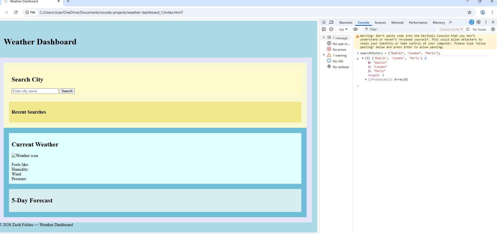

# 🌦️ Weather Dashboard


**Developer: Zsolt Földes**

[Visit live website](https://zsolt68.github.io/weather-dashboard_1/)

## Table of Content
  - [Project Goals](#project-goals)
    - [User Goals](#user-goals)
    - [Site Owner Goals](#site-owner-goals)
  - [User Experience](#user-experience)
    - [Target Audience](#target-audience)
    - [User Requirements and Expectations](#user-requirements-and-expectations)
  - [User Stories](#user-stories)
    - [Site User](#site-user)
    - [Site Owner](#site-owner)
  - [Design](#design)
    - [Colour Scheme](#colour-scheme)
    - [Fonts](#fonts)
    - [Structure](#structure)
    - [Wireframes](#wireframes)
  - [Technologies Used](#technologies-used)
    - [Languages](#languages)
    - [Frameworks, Libraries & Tools](#frameworks-libraries--tools)
  - [Features](#features)
  - [Validation](#validation)
    - [HTML Validation](#html-validation)
    - [CSS Validation](#css-validation)
    - [JavaScript Validation](#javascript-validation)
    - [Accessibility](#accessibility)
    - [Performance](#performance)
  - [Testing](#testing)
    - [Performing tests on various devices](#performing-tests-on-various-devices)
    - [Browser compatibility](#browser-compatibility)
    - [Testing user stories](#testing-user-stories)
  - [Bugs](#bugs)
  - [Deployment](#deployment)
  - [Credits](#credits)
  - [Acknowledgements](#acknowledgements)

## Project Goals

The goal of this project was to create an interactive and user‑friendly Weather Dashboard that allows users to search for any city and instantly view the current weather, 5‑day forecast, and recent search history. The application aims to provide clear, accurate, and accessible weather information using real‑time API data.

### User Goals

- Quickly check the current weather for any city
- View a simple and clear 5‑day forecast
- Access recent searches without retyping
- Use a clean, intuitive interface
- Enjoy a smooth experience on any device

### Site Owner Goals

- Create an engaging and visually appealing weather application
- Provide accurate, real‑time weather data using a public API
- Ensure simple navigation and clear presentation of information
- Deliver a fully responsive and accessible website
- Implement reliable search history functionality using localStorage

## User Experience

### Target Audience

- Anyone who wants quick access to weather information
- Users who travel frequently or check the weather across multiple cities
- People who prefer simple, clean, and intuitive interfaces
- Users on mobile, tablet, or desktop devices

### User Requirements and Expectations

Users expect:
- Clear and easy‑to‑understand weather information
- Simple navigation and intuitive layout
- A responsive interface that works on all devices
- Accurate and real‑time weather data
- Recent searches that work reliably
- Fast loading and smooth interactions
- Accessible design with readable text and proper contrast
- Functional links, buttons, and interactive elements
- A way to contact the developer or provide feedback

## User Stories
### Site User

- I want to easily understand how to search for a city and view its weather
- I want to see the current weather displayed clearly and accurately.
- I want to view a 5‑day forecast so I can plan ahead.
 -I want to see weather icons that visually represent the conditions.
- I want to quickly access my recent searches without typing again.
- I want the recent search buttons to work reliably and load the correct city.
- I want the website to load fast and respond smoothly.
- I want the layout to be simple, clean, and easy to navigate.
- I want the website to work on desktop, tablet, and mobile devices.
- I want the information to be readable with good contrast and accessible design.
- I want to be able to contact the developer if I have questions or feedback.

### Site Owner

- I want users to understand how to use the Weather Dashboard easily.
- I want users to receive accurate, real‑time weather information.
- I want the site to be visually appealing and intuitive.
- I want the website to be fully responsive across all devices.
- I want the recent search feature to encourage users to return and explore more cities.
- I want the site to handle invalid URLs gracefully with a custom 404 page.
- I want users to be able to contact me and provide feedback.
- I want the codebase to be clean, maintainable, and easy to expand in the future.
- A responsive weather application that allows users to search for any city and view current conditions and a 5‑day forecast. Built with HTML, CSS, and JavaScript using the OpenWeather API.

## 🌦️ Weather Dashboard Wireframe


---


## 📁 Project Structure
```
main/
│
├── .vscode/
│   └── settings.json              # Editor configuration (if present)
│
├── assets/
│   ├── css/
│   │   ├── style.css              # Main stylesheet
│   │   └── images/
│   │       └── icon-rain-cloud.png
│   │
│   └── js/
│       └── script.js              # Main JavaScript logic
│
├── docs/
│   ├── Dev 1.png
│   ├── Dev 1.1.png
│   ├── Dev 2.1.png
│   ├── Dev 3.png
│   ├── Dev 4.png
│   ├── Dev 5.png
│   ├── Dev 6.png
│   ├── Dev 7.png
│   ├── Dev_debug_step 5.png
│   ├── HTML_Validator.png
│   ├── JSHint_validation.png
│   ├── Jigsaw_css_validation.png
│   ├── Lighthouse_test.png
│   ├── Mock_website.png
│   ├── flat-devices-mockup.png
│   └── TESTING.md                 # Full testing documentation
│
├── index.html                     # Main HTML file
├── style.css                      # (If separate from assets/css)
└── README.md                      # Project documentation

```
## Project Development

1. Divs done in the HTML file > Dev 1


Visual Map
- Step 1 → Form handler
- Step 2 → fetchWeather()
- Step 3 → res.ok + catch()
- Step 4 → updateCurrentWeather()  
- Step 5 → forecast
- Step 6 → search history

script.js order
1. API URLs + API key
2. Event listeners
3. fetchWeather()
4. updateCurrentWeather()   ← Step 4
5. fetchForecast()          ← Step 5 (first function)
6. updateForecastUI()       ← Step 5 (second function)
7. Step 6 functions (search history)

### Step I. – Add minimal script.js and test form submit in Dev Tools/Console
For this step, I only wire the form and log the city, no Weather API yet. > 
```
// Select form, input, and message elements
const form = document.getElementById("search-form");
const input = document.getElementById("city-input");
const message = document.getElementById("search-message");

// Handle form submit
form.addEventListener("submit", function (e) {
  e.preventDefault(); // Stop page reload
  const city = input.value.trim(); // Get city text
  if (city === "") {
    message.textContent = "Please enter a city name.";
setTimeout(() => (message.textContent = ""), 3000);
    return;
  }
  console.log("Searching for city:", city); // Temp test output
  input.value = ""; // Clear input
});
```

Test it:
1.	Open DevTools → Console.
2.	Type a city (e.g. Dublin) and click Search.
3.	You should see: Searching for city: Dublin
4.	Try empty input → you should see the message under the form.

### Step II: add current weather API call, test it, and commit that as a separate, clean change.

1. DOM selectors
2. API key
3. Form submit handler
4. fetchWeather()
5. updateCurrentWeather()
6. forecast functions

### Step 1 — Handle form submit and validate the city > Add form submit handler with basic city validation and test "Please enter a city name” time out 3000 milliseconds
Code (Step 1) > 

```
// Form, input, and message elements
const form = document.getElementById("search-form");
const input = document.getElementById("city-input");
const message = document.getElementById("search-message");

// Listen for form submit
form.addEventListener("submit", function (e) {
  e.preventDefault(); // Stop page reload

  const city = input.value.trim(); // Read city text

  if (city === "") {
    message.textContent = "Please enter a city name.";
    setTimeout(() => (message.textContent = ""), 3000);
    return;
  }

  console.log("Searching for city:", city); // Debug log

  // (In Step 1 we only log; fetchWeather will be added later)
  input.value = ""; // Clear input
});
```


### Step 2 - Create fetchWeather() and perform the first API request or basic fetch
This step adds the function that actually contacts the OpenWeather API. No UI updates yet — just a working fetch and console output.

Code-step 2

```
// Fetch current weather data for the given city
function fetchWeather(city) {

  // Log the city value for debugging
  console.log("fetchWeather called with:", city);

  // Build full API request URL with city, key, and metric units
  const url = `${currentWeatherURL}?q=${city}&appid=${apiKey}&units=metric`;

  // Log URL to verify correct request format
  console.log("STEP 1: about to call fetch with URL:", url);

  // Send HTTP request to OpenWeather API
  fetch(url)
    .then((res) => {
      // Log raw response object for debugging
      console.log("STEP 2: raw response:", res);

      // Convert response body to JSON
      return res.json();
    })
    .then((data) => {
      // Log parsed JSON for debugging
      console.log("STEP 3: parsed JSON data:", data);
    });
}
```
I saw this in the Console:
-------------------------------------
fetchWeather called with: Dublin
STEP 1: about to call fetch with URL: ...
STEP 2: raw response: Response { ... }
STEP 3: parsed JSON data: { ... }


### Step 3 - Add API Error Handling (res.ok + .catch)
🎯 Goal of Step 3
Make the app handle:
•	Invalid city names
•	API errors (404, 401, 500…)
•	Network failures
•	Broken URLs
•	Any unexpected fetch issues
…and show a friendly message instead of crashing.
Step 3- code

```
fetch(url)
  .then((res) => {
// Log raw HTTP response for debugging
    console.log("STEP 2: raw response:", res);
    // Check if API returned a success status (200–299)
    if (!res.ok) {
// Log failed status code for debugging
      console.log("STEP 3: response NOT OK, status:", res.status);
// Stop chain and send error to catch()
      throw new Error("City not found");
    }
// Log success before converting to JSON
    console.log("STEP 3: response OK, converting to JSON");
// Convert response body to JSON object
    return res.json(); 
  })
  .then((data) => {
    console.log("STEP 4: parsed JSON data:", data);
    updateCurrentWeather(data); // Update UI with weather data
  })
  .catch((error) => {
    console.log("STEP 5: error in fetch chain:", error.message);

    // Show user-friendly error message
    message.textContent = "City not found.";

    // Clear message after 3 seconds
    setTimeout(() => (message.textContent = ""), 3000);
  });
```
•	.then((res) => { … }) receives the raw HTTP response
•	Step 3 must check res.ok before converting to JSON
•	If the response is bad, we throw an error
•	The thrown error jumps directly to .catch()
•	The next .then((data) => …) only runs on success
res.ok
Checks if the API returned a successful HTTP status (200–299). If not, we throw an error to stop the chain.
✔ throw new Error("City not found")
Forces the code to jump to .catch().
✔ .catch(error)
Handles all errors:
•	Invalid city
•	Network down
•	Wrong API key
•	Broken URL
•	JSON parsing issues
✔ User-friendly message
Instead of crashing, the UI shows: City not found, then clears after 3 seconds.
res.ok is used to check whether the HTTP response from the OpenWeather API was successful (status 200–299). If the response is not OK, I throw an error to stop the promise chain.
.catch() handles all errors from the fetch process, including invalid city names, network failures, or thrown errors. It displays a user friendly message and prevents the app from crashing.


### Step 4 - Update the Current Weather UI
🎯 Goal
Take the parsed JSON from Step 3 and display:
•	City name
•	Date
•	Weather icon
•	Temperature
•	Description
•	Feels like
•	Humidity
•	Wind
•	Pressure
This is done inside a new function: updateCurrentWeather(data)

Step 4 – code

```
// Update the Current Weather section with API data
function updateCurrentWeather(data) {

  // Get city name from API response
  const cityName = data.name;

  // Convert timestamp to readable date
  const date = new Date(data.dt * 1000).toLocaleDateString("en-GB");

  // Build icon URL using icon code from API
  const iconCode = data.weather[0].icon;
  const iconURL = `https://openweathermap.org/img/wn/${iconCode}@2x.png`;

  // Update city name and date in UI
  document.getElementById("city-name").textContent = cityName;
  document.getElementById("current-date").textContent = date;
```


```
  // Update weather icon image
  document.getElementById("weather-icon").src = iconURL;

  // Update temperature (°C)
  document.getElementById("temperature").textContent =
    `${data.main.temp}°C`;
```


```
// Update weather description (e.g., "Cloudy")
  document.getElementById("description").textContent =
    data.weather[0].description;

  // Update "feels like" temperature
  document.getElementById("feels-like").textContent =
    `${data.main.feels_like}°C`;

  // Update humidity percentage
  document.getElementById("humidity").textContent =
    `${data.main.humidity}%`;

  // Update wind speed (m/s)
  document.getElementById("wind").textContent =
    `${data.wind.speed} m/s`;

  // Update pressure (hPa)
  document.getElementById("pressure").textContent =
    `${data.main.pressure} hPa`;

  // Log confirmation for testing
  console.log("STEP 4: UI updated with current weather data");
}

fetchWeather() calls updateCurrentWeather(data)
```
Therefore, Step 4 must be defined after Step 3, but before any forecast or search history functions.


### STEP 5 — Add the 5 Day Forecast
🎯 Goal
Fetch the forecast endpoint, filter the 3 hour data into 5 days, and display:
•	date
•	icon
•	temperature
•	description
Each day becomes a small forecast card.
Code for step 5 >

```
// Fetch 5-day forecast data from API
function fetchForecast(city) {

  // Build forecast API URL
  const url = `${forecastURL}?q=${city}&appid=${apiKey}&units=metric`;

  console.log("STEP 5: Fetching forecast with URL:", url);

  fetch(url)
    .then((res) => {
      console.log("STEP 5: raw forecast response:", res);

      // Handle invalid city
      if (!res.ok) {
        throw new Error("Forecast not found");
      }

      return res.json();
    })
    .then((data) => {
      console.log("STEP 5: forecast JSON data:", data);
      updateForecastUI(data);
    })
    .catch((error) => {
      console.log("STEP 5: forecast error:", error.message);
    });
}
```


### STEP 6 — Add Search History(localStorage + clickable items)

### 6.1 — Add history array at the top of script.js
let searchHistory = [];

### 6.2 — Load history on page load
loadHistory();

### 6.3 — Save a city to history

```
// Save a searched city into history and localStorage
function saveToHistory(city) {
  // Skip if city already exists in history
  if (!searchHistory.includes(city)) {
    // Add city to in-memory history array
    searchHistory.push(city);
    // Persist updated history to localStorage
    localStorage.setItem("history", JSON.stringify(searchHistory));
    // Re-render the visible history list
    renderHistory();
  }
}
```


### 6.4 — Render the history list

```
// Build the visible list of past searches
function renderHistory() {
  // Get the <ul> that holds history items
  const list = document.getElementById("history-list");
  // Clear existing list items
  list.innerHTML = "";

  // Create one <li> per saved city
  searchHistory.forEach(city => {
    // Create a new list item element
    const li = document.createElement("li");
    // Show the city name as text
    li.textContent = city;
    // Add CSS class for styling
    li.classList.add("history-item");

    // Allow clicking a history item to search again
    li.addEventListener("click", () => {
      // Trigger a new weather fetch for this city
      fetchWeather(city);
    });

    // Add the list item to the history <ul>
    list.appendChild(li);
  });
}

```
### 6.5 — Load history from localStorage

```
// Restore search history from localStorage on startup
function loadHistory() {
  // Read stored history string from localStorage
  const stored = localStorage.getItem("history");
  // If something was stored, parse and use it
  if (stored) {
    // Convert JSON string back to array
    searchHistory = JSON.parse(stored);
    // Render the restored history list
    renderHistory();
  }
}

```

Call loadHistory() once at the bottom
// Load saved search history when the page first loads
loadHistory();

Wire it into your form submit
Inside your existing submit handler:

```
form.addEventListener("submit", function (e) {
  e.preventDefault();

  const city = input.value.trim();

  if (city === "") {
    message.textContent = "Please enter a city name.";
    setTimeout(() => (message.textContent = ""), 3000);
    return;
  }

  console.log("Searching for city:", city);

  // Fetch weather for the entered city
  fetchWeather(city);
  // Save this city into search history
  saveToHistory(city);
  // Clear the input field
  input.value = "";
});

```
### 6.6 — Save history when a search is made
fetchWeather(city);
saveToHistory(city);
input.value = "";


---

## 🧩 Features

### 🔍 Search City

- Search for any city worldwide
- Display current temperature, humidity, wind speed, and pressure.
- Input validation and error handling
- 5‑day forecast with icons and daily summaries.
- Click on the Search button from the "Search for a City" for instant local weather.
- Click on the already searched locations from the "Recent Searches" history for quick weather access.
- Responsive layout for desktop and mobile

### 🌤️ Current Weather Display
Shows:
- City name
- Date
- Weather icon
- Temperature
- Description
- Feels like
- Humidity
- Wind speed (converted to km/h)
- Pressure

### 📅 5‑Day Forecast
Each card includes:
- Date
- Weather icon
- Temperature
- Description

### 🕒 Recent Searches
Stores last 5 searched cities
- Prevents duplicates
- Cleans and trims city names
- Clicking a city loads its weather instantly
-Stored using localStorage

###📱 Responsive Design

- Fully responsive layout
-Works on desktop, tablet, and mobile
- Flexible grid and card layout

### Design
🎨 Color Scheme

- Soft blue background for a calm, weather‑themed feel
-White cards for clean contrast
- Blue accents for buttons and highlights
- High contrast for accessibility
 ### 🖼️ Layout
 
- Left panel: Search + Recent Searches
- Right panel: Current Weather + Forecast
- Mobile layout stacks sections vertically

---

### Technologies Used

- HTML5
- CSS3
- JavaScript (ES6)
- OpenWeatherMap API
- localStorage
- Deployment: GitHub
- Version Control: Git & GitHub
-  GitHub Pages
  
 ---
 ## Testing
 
### ✔ HTML Validation
- Passed W3C Validator
- Fixed empty heading warnings
- Added placeholder src to avoid empty image errors


### Lighthouse Report


### ✔ CSS Validation
- Passed W3C CSS Validator
- No critical errors
- 


### ✔ JavaScript Validation
- Passed JSHint
- Only warnings present (acceptable for CI)


### ✔ Manual Testing

- Search functionality tested with multiple cities
- Recent Searches feature tested
- Error handling tested (invalid city, empty input)
- Responsive design tested on mobile, tablet, laptop and desktop
- Forecast cards display correct data
- API errors handled gracefully
Please check the TESTING.md file as well from the project's docs folder
---

## Project Deployment

The Weather Dashboard can be deployed online or run locally. Below are clear instructions for both.

###🚀 GitHub Pages Deployment
The project is deployed using GitHub Pages.
- Go to Settings → Pages
- Under Source, select:
- Branch: main
- Folder: /root
- click Save
- GitHub will generate a live URL, for example: https://your-username.github.io/weather-dashboard/
- Your site will now be publicly accessible at: https://your-username.github.io/weather-dashboard/
  
### Local Deployment

### Cloning the Repository
To clone the project:
- Open your terminal.
- Run: git clone https://github.com/your-username/weather-dashboard.git
- Navigate into the folder: cd weather-dashboard
- Open the project in your preferred editor (VS Code, Gitpod, etc.).

### Running the Project Locally
This project does not require a server.
- Open the project folder.
- Double‑click index.html to open it in your browser.
- Ensure your OpenWeatherMap API key is correctly added to your JavaScript file.
The site will run immediately.

---

## Scope for Improved UX on First Arriving on the Application
While the Weather Dashboard is functional and easy to use, there is room to enhance the user experience when first landing on the page.

### 1. Display a Default City
Instead of showing an empty dashboard, the app could automatically load:
- the user’s current location (via geolocation), or
- a default city such as Dublin or London.
This provides immediate value and avoids an empty interface.

### 2. Add a Welcome Message
A short introductory message could explain:
- how to search for a city
- what information will be displayed
- how recent searches work
This helps first‑time users understand the app instantly.

### 3. Highlight the Search Bar
A subtle animation or highlight could draw attention to the search input, guiding the user’s first action.

### 4. Provide Example Searches
Clickable suggestions such as:

- “Try: Paris, Tokyo, New York”
This helps users understand what to do immediately.

### 5. Improve Visual Hierarchy
Ensuring that the search bar and the main weather card are visually dominant helps users know where to start.

### 6. Add a Loading State
A simple loading spinner or “Fetching weather…” message improves clarity and perceived performance.


---

## 🧪 Testing

- Manual testing on Chrome, Edge, and mobile browsers
- Verified responsive layout using Chrome DevTools
- Checked API responses for multiple cities
- Lighthouse audit for performance and accessibility

---

## 🐞 Bugs and Fixes

| Issue | Fix |
|-------|-----|
| Empty screen on first load•	step 5 did not appear in the console > the weather cards are not created. Fix forecast container ID mismatch by targeting #forecast-cards for 5‑day output | Added default city (Dublin) | 


| •	Temperature, “Feels like”and weather cards show in decimals instead of whole numbers  | Round current temperature and feels-like values to whole numbers for cleaner UI” |

Applied flexbox layout to #forecast-cards for horizontal 5‑day forecast display Committed and pushed folder manually |

---

## 🚀 Deployment

The project is deployed on **GitHub**.  
To run : Go to
```
- git clone https://github.com/Zsolt68/weather-dashboard_1.git
- cd weather-dashboard_1
- open index.html
```

---

## 📸 Screenshots

assets/images/weather-dashboard_2026-03-09_002814.png

## 🔮 Future Enhancements 

- Add hourly forecast view
- Include weather alerts
- Add dark/light theme toggle
- Improve accessibility with ARIA labels

---

## 🧾 Credits

- OpenWeather API for data
- Icons from OpenWeatherMap

### 🧑‍💻 Developer
 Zsolt Földes  
Weather Dashboard — 2026

### 🙏 Acknowledgements
- Code Institute learning materials
- MDN Web Docs
- Stack Overflow community

