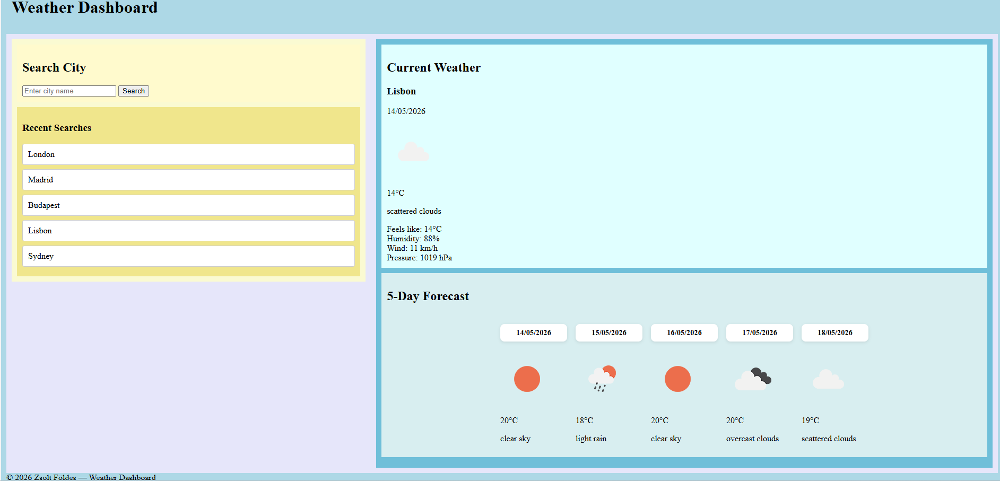

# 🌦️ Weather Dashboard


**Developer: Zsolt Földes**

A responsive weather application that allows users to search for any city and view current conditions and a 5‑day forecast. Built with HTML, CSS, and JavaScript using the OpenWeather API.

# 🌦️ Weather Dashboard Wireframe

+-------------------------------------------------------------+
|                        Weather Dashboard                    |
+-------------------------------------------------------------+

| Search for a City | Current Weather |
| --- | --- |
| [ Search Bar ] | City: Baia Mare |
| [ Search Button ] | Temperature: 11°C |
| [ Use My Location] | Condition: Few Clouds ☁️ |
|  | Feels Like: 11°C |
| Recent Searches: | Humidity: 94% |
| - Baia Mare | Wind: 3 km/h |
| - Romania | Pressure: 1017 hPa |
| - Ireland |  |
| - Dublin |  |
| - Ballinteer |  |

| 5‑Day Forecast |
| --- |
| 2026‑05‑10 | 11°C | Scattered Clouds | ☁️ |
| 2026‑05‑11 | 11°C | Clear Sky | ☀️ |
| 2026‑05‑12 | 13°C | Light Rain | 🌧️ |
| 2026‑05‑13 | 8°C | Light Rain | 🌦️ |
| 2026‑05‑14 | 8°C | Overcast Clouds | ☁️ |

+-------------------------------------------------------------+


---

## 🧩 Features
- Search for any city worldwide
- Display current temperature, humidity, wind speed, and pressure.
- 5‑day forecast with icons and daily summaries.
- Click on the Search button from the "Search for a City" for instant local weather.
- Click on the already searched locations from the "Recent Searches" history for quick weather access.
- Responsive layout for desktop and mobile

---

## 🧠 UX Design
- Clear welcome message and instructions on first load
- Default city (Dublin) displayed to avoid an empty state
- Prominent search bar and geolocation button
- Consistent card layout for forecast data
- Accessible colour palette and readable typography

---

## 🧰 Technologies Used
| Category | Tools |
|-----------|-------|
| Languages | HTML5, CSS3, JavaScript |
| Frameworks | Bootstrap 5 |
| APIs | OpenWeather API |
| Version Control | Git & GitHub |
| Deployment | GitHub |

---

## 📁 Project Structure
weather-dashboard_1/
│
├── index.html
├── style.css
├── script.js
│
└── assets/
├── css/
├── js/
└── images/

---

## 🧪 Testing

- Manual testing on Chrome, Edge, and mobile browsers
- Verified responsive layout using Chrome DevTools
- Checked API responses for multiple cities
- Lighthouse audit for performance and accessibility

---

## 🐞 Bugs and Fixes

| Issue | Fix |
|-------|-----|
| Empty screen on first load | Added default city (Dublin) |
| Unclear UX on arrival | Added welcome message and instructions |
| Missing images folder on GitHub | Committed and pushed folder manually |

---

## 🚀 Deployment

The project is deployed on **GitHub**.  
To run : Go to
```
- git clone https://github.com/Zsolt68/weather-dashboard_1.git
- cd weather-dashboard_1
- open index.html
```

---

## 📸 Screenshots

assets/images/weather-dashboard_2026-03-09_002814.png

## 🔮 Future Enhancements 

- Add hourly forecast view
- Include weather alerts
- Add dark/light theme toggle
- Improve accessibility with ARIA labels

---

## 🧾 Credits

- OpenWeather API for data
- Bootstrap for layout
- Icons from Font Awesome

## 🧑‍💻 Author

Zsolt Földes 
