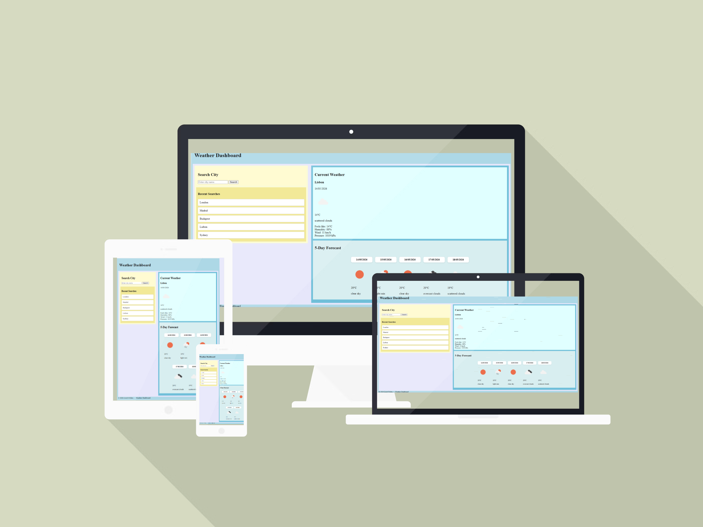
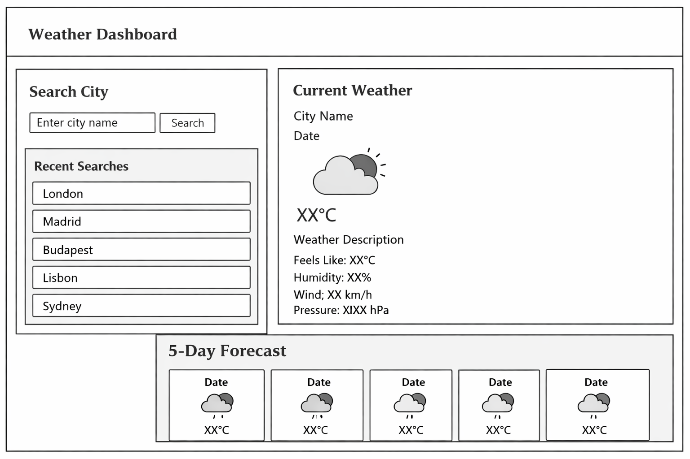
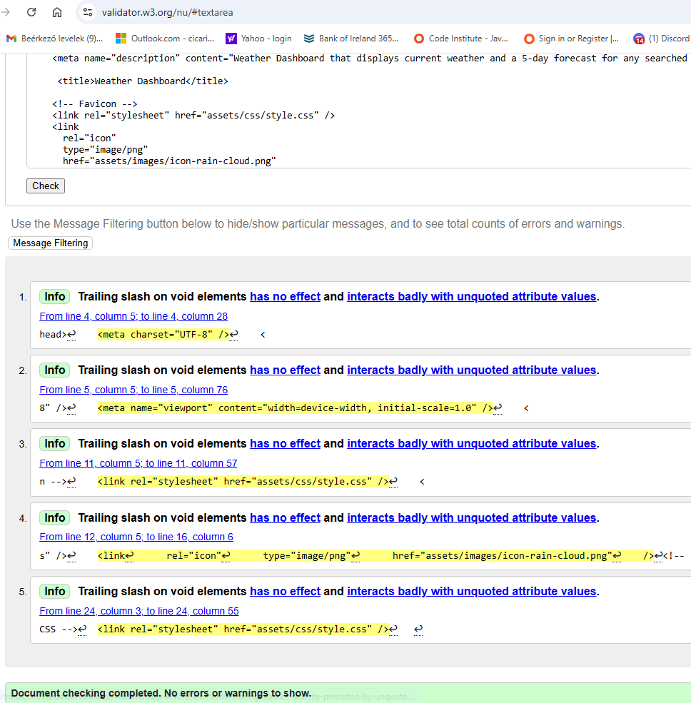
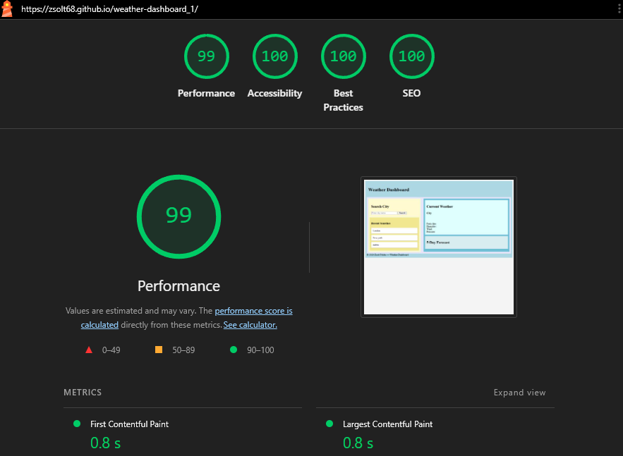
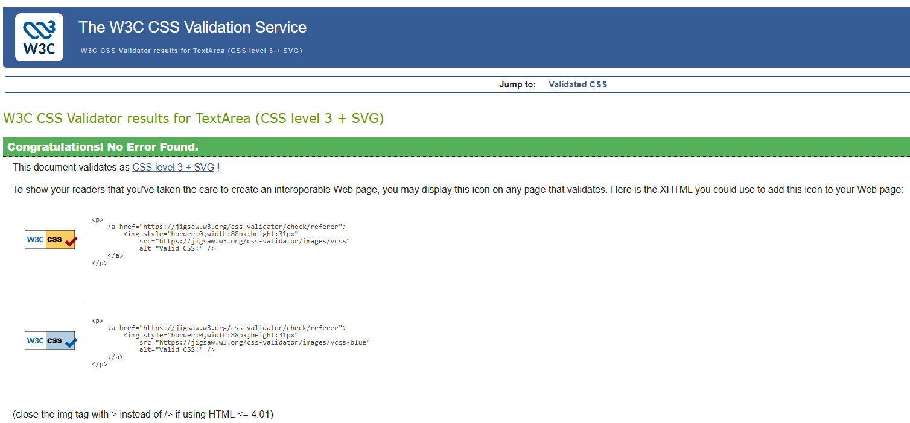
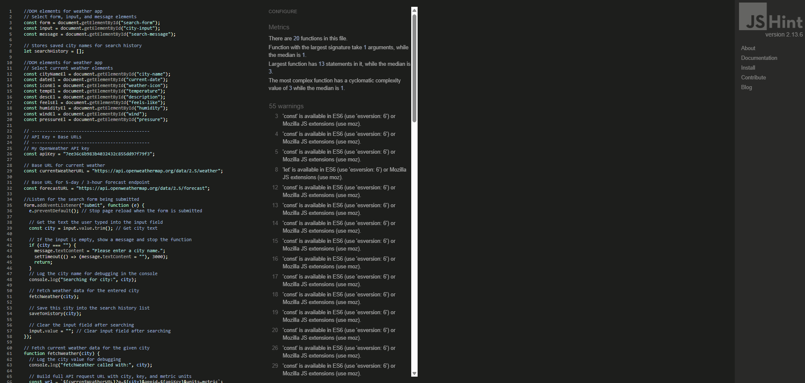

# 🌦️ Weather Dashboard



**Developer: Zsolt Földes**

[Visit live website](https://zsolt68.github.io/weather-dashboard_1/)

## Table of Content
  - [Project Goals](#project-goals)
    - [User Goals](#user-goals)
    - [Site Owner Goals](#site-owner-goals)
  - [User Experience](#user-experience)
    - [Target Audience](#target-audience)
    - [User Requirements and Expectations](#user-requirements-and-expectations)
  - [User Stories](#user-stories)
    - [Site User](#site-user)
    - [Site Owner](#site-owner)
  - [Design](#design)
    - [Colour Scheme](#colour-scheme)
    - [Fonts](#fonts)
    - [Structure](#structure)
    - [Wireframes](#wireframes)
  - [Technologies Used](#technologies-used)
    - [Languages](#languages)
    - [Frameworks, Libraries & Tools](#frameworks-libraries--tools)
  - [Features](#features)
  - [Validation](#validation)
    - [HTML Validation](#html-validation)
    - [CSS Validation](#css-validation)
    - [JavaScript Validation](#javascript-validation)
    - [Accessibility](#accessibility)
    - [Performance](#performance)
  - [Testing](#testing)
    - [Performing tests on various devices](#performing-tests-on-various-devices)
    - [Browser compatibility](#browser-compatibility)
    - [Testing user stories](#testing-user-stories)
  - [Bugs](#bugs)
  - [Deployment](#deployment)
  - [Credits](#credits)
  - [Acknowledgements](#acknowledgements)

## Project Goals

The goal of this project was to create an interactive and user‑friendly Weather Dashboard that allows users to search for any city and instantly view the current weather, 5‑day forecast, and recent search history. The application aims to provide clear, accurate, and accessible weather information using real‑time API data.

### User Goals

- Quickly check the current weather for any city
- View a simple and clear 5‑day forecast
- Access recent searches without retyping
- Use a clean, intuitive interface
- Enjoy a smooth experience on any device

### Site Owner Goals

- Create an engaging and visually appealing weather application
- Provide accurate, real‑time weather data using a public API
- Ensure simple navigation and clear presentation of information
- Deliver a fully responsive and accessible website
- Implement reliable search history functionality using localStorage

## User Experience

### Target Audience

- Anyone who wants quick access to weather information
- Users who travel frequently or check the weather across multiple cities
- People who prefer simple, clean, and intuitive interfaces
- Users on mobile, tablet, or desktop devices

### User Requirements and Expectations

Users expect:
- Clear and easy‑to‑understand weather information
- Simple navigation and intuitive layout
- A responsive interface that works on all devices
- Accurate and real‑time weather data
- Recent searches that work reliably
- Fast loading and smooth interactions
- Accessible design with readable text and proper contrast
- Functional links, buttons, and interactive elements
- A way to contact the developer or provide feedback

## User Stories
### Site User

- I want to easily understand how to search for a city and view its weather
- I want to see the current weather displayed clearly and accurately.
- I want to view a 5‑day forecast so I can plan ahead.
 -I want to see weather icons that visually represent the conditions.
- I want to quickly access my recent searches without typing again.
- I want the recent search buttons to work reliably and load the correct city.
- I want the website to load fast and respond smoothly.
- I want the layout to be simple, clean, and easy to navigate.
- I want the website to work on desktop, tablet, and mobile devices.
- I want the information to be readable with good contrast and accessible design.
- I want to be able to contact the developer if I have questions or feedback.

### Site Owner

- I want users to easily understand how to use the Weather Dashboard.
- I want users to receive accurate, real‑time weather information.
- I want the site to be visually appealing and intuitive.
- I want the website to be fully responsive across all devices.
- I want the recent search feature to encourage users to return and explore more cities.
- I want the site to handle invalid URLs gracefully with a custom 404 page.
- I want users to be able to contact me and provide feedback.
- I want the codebase to be clean, maintainable, and easy to expand in the future.
- A responsive weather application that allows users to search for any city and view current conditions and a 5‑day forecast. Built with HTML, CSS, and JavaScript using the OpenWeather API.

## 🌦️ Weather Dashboard Wireframe


---

## 🧩 Features

### 🔍 Search City

- Search for any city worldwide
- Display current temperature, humidity, wind speed, and pressure.
- Input validation and error handling
- 5‑day forecast with icons and daily summaries.
- Click on the Search button from the "Search for a City" for instant local weather.
- Click on the already searched locations from the "Recent Searches" history for quick weather access.
- Responsive layout for desktop and mobile

### 🌤️ Current Weather Display
Shows:
- City name
- Date
- Weather icon
- Temperature
- Description
- Feels like
- Humidity
- Wind speed (converted to km/h)
- Pressure

### 📅 5‑Day Forecast
Each card includes:
- Date
- Weather icon
- Temperature
- Description

### 🕒 Recent Searches
Stores last 5 searched cities
- Prevents duplicates
- Cleans and trims city names
- Clicking a city loads its weather instantly
-Stored using localStorage

###📱 Responsive Design

- Fully responsive layout
-Works on desktop, tablet, and mobile
- Flexible grid and card layout

### Design
🎨 Color Scheme

- Soft blue background for a calm, weather‑themed feel
-White cards for clean contrast
- Blue accents for buttons and highlights
- High contrast for accessibility
 ### 🖼️ Layout
 
- Left panel: Search + Recent Searches
- Right panel: Current Weather + Forecast
- Mobile layout stacks sections vertically

---

### Technologies Used

- HTML5
- CSS3
- JavaScript (ES6)
- OpenWeatherMap API
- localStorage
- Deployment: GitHub
- Version Control: Git & GitHub
-  GitHub Pages
  
 ---
 ## Testing
 
### ✔ HTML Validation
- Passed W3C Validator
- Fixed empty heading warnings
- Added placeholder src to avoid empty image errors


### Lighhouse Report




### ✔ CSS Validation
- Passed W3C CSS Validator
- No critical errors
- 


### ✔ JavaScript Validation
- Passed JSHint
- Only warnings present (acceptable for CI)




### ✔ Manual Testing

- Search functionality tested with multiple cities
- Recent Searches feature tested
- Error handling tested (invalid city, empty input)
- Responsive design tested on mobile, tablet, laptop and desktop
- Forecast cards display correct data
- API errors handled gracefully

---

## Deployment

###🚀 GitHub Pages
- Go to Settings → Pages
- Select branch: main
- Folder: /root
- Save
- Your site becomes available at: https://your-username.github.io/weather-dashboard/

### Local Deployment
- Clone the repository
- Open index.html in any browser
- No server required
- 
---

## 📁 Project Structure
'''
weather-dashboard_1/
│
├── index.html
├── style.css
├── script.js
│
└── assets/
├── css/
├── js/
└── images/
'''
---

## 🧪 Testing

- Manual testing on Chrome, Edge, and mobile browsers
- Verified responsive layout using Chrome DevTools
- Checked API responses for multiple cities
- Lighthouse audit for performance and accessibility

---

## 🐞 Bugs and Fixes

| Issue | Fix |
|-------|-----|
| Empty screen on first load•	step 5 did not appear in the console > the weather cards are not created. Fix forecast container ID mismatch by targeting #forecast-cards for 5‑day output | Added default city (Dublin) | 


| •	Temperature, “Feels like”and weather cards show in decimals instead of whole numbers  | Round current temperature and feels-like values to whole numbers for cleaner UI” |

Applied flexbox layout to #forecast-cards for horizontal 5‑day forecast display Committed and pushed folder manually |

---

## 🚀 Deployment

The project is deployed on **GitHub**.  
To run : Go to
```
- git clone https://github.com/Zsolt68/weather-dashboard_1.git
- cd weather-dashboard_1
- open index.html
```

---

## 📸 Screenshots

assets/images/weather-dashboard_2026-03-09_002814.png

## 🔮 Future Enhancements 

- Add hourly forecast view
- Include weather alerts
- Add dark/light theme toggle
- Improve accessibility with ARIA labels

---

## 🧾 Credits

- OpenWeather API for data
- Icons from OpenWeatherMap

### 🧑‍💻 Developer
 Zsolt Földes  
Weather Dashboard — 2026

### 🙏 Acknowledgements
- Code Institute learning materials
- MDN Web Docs
- Stack Overflow community

